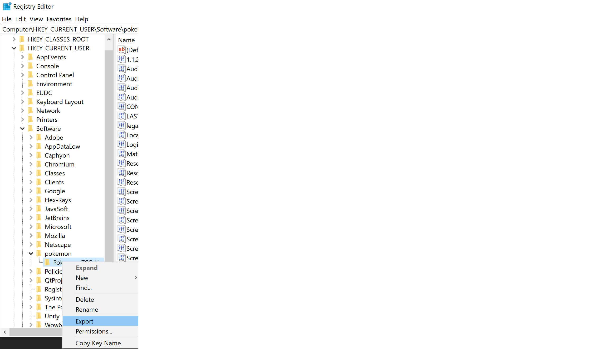

# Pokemon TCG Live Credential Extractor
A tool to transfer Pokemon TCG Live authentication tokens from a working Windows installation to Wine. This is necessary because the game uses a Unity extension called Vuplex to show a login window 
when initially logging into the game, however it appears to use low level functionality that is not yet compatible with Wine, causing a crash. This tool allows you to bypass the broken login functionality
by exporting your credentials from a Windows machine to the Wine prefix so you can skip Vuplex altogether.

## Step-by-Step Instructions
1. Create and configure a new Wine prefix:

```
WINEARCH=win64 WINEPREFIX=~/prefixes/ptcgl winecfg
```

2. If using wine-staging, navigate to `Staging` tab and disable CSMT
3. Install VC runtime with `winetricks:

```
WINEARCH=win64 WINEPREFIX=~/prefixes/ptcgl winetricks vcrun2017
```

4. Install PTCG Live in Wine but do not launch it when finished:

```
WINEARCH=win64 WINEPREFIX=~/prefixes/ptcgl wine PokemonTCGLiveInstaller.msi
```

5. Log into Pokemon TCG Live on Windows Machine
6. After loading into the game, exit Pokemon TCG Live
7. Click Start, type regedit, navigate to HKEY_CURRENT_USER->Software->pokemon->Pokemon TCG Live
8. Right click Pokemon TCG Live and click Export, copy the .reg file to the Linux machine:



9. Download `Cred.exe` from the releases page or compile it with Visual Studio and run `Cred.exe read` from the Windows command line
10. Copy the token shown, as well as the `Cred.exe` file to the Linux machine
11. Run `WINEARCH=win64 WINEPREFIX=~/prefixes/tcgl wine Cred.exe write <token>`
12. Run `WINEARCH=win64 WINEPREFIX=~/prefixes/tcgl wine regedit /path/to/reg/file
13. Launch PTCG Live on Linux